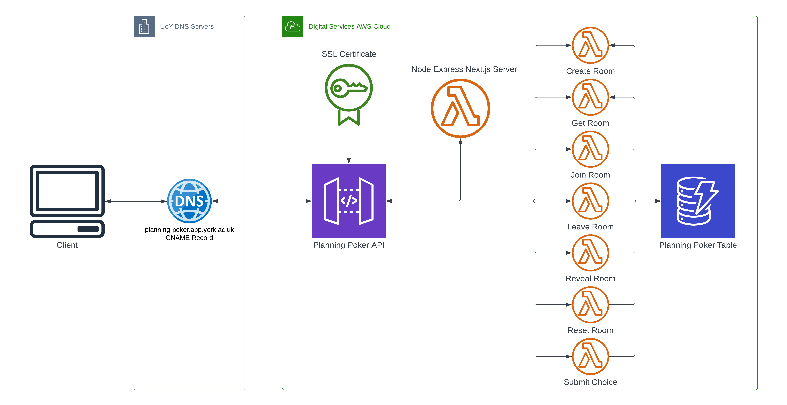

# Planning Poker

Production: [planning-poker.app.york.ac.uk](https://planning-poker.app.york.ac.uk/)  
Development: [planning-poker.dev.app.york.ac.uk](https://planning-poker.dev.app.york.ac.uk/)

Based on the estimation & refinement practices of the Digital Services Teaching & Learning team, Planning Poker is designed to facilitate blind, unbiased estimating of tasks in T-shirt sizes.
Anyone can access this application, create a new planning session, and send invite links for their teammates to join.
Team members then vote on the estimate for a task, and when all members have voted the host can reveal the result.

Planning Poker is a [Next.js](https://nextjs.org/) application built with [Typescript](https://www.typescriptlang.org/) and deployed to [AWS](https://aws.amazon.com/) using [Serverless](https://www.serverless.com/).

## Getting started

This project contains several npm scripts for checking code quality as changes are developed.
These scripts are designed to be system-agnostic - they should run identically on Linux, Windows & Github runner systems.
This is achieved by using the following dependencies which are system-agnostic:
 - `cross-env`: Allows environment variables to be set on any OS
 - `wait-on`: Allows scripts to wait for the server to boot before running
 - `npm-run-all`: Allows scripts to be run in parallel 
   - (using `&` instead of `&&` is a linux-only solution with other side-effects)

You can run these tasks individually with the commands:
 - `npm run checkformat` or `npm run cf` to check formatting
 - `npm run format` to apply formatting
 - `npm run lint` to check for code smells
 
You can check the build of the application with:
 - `npm run build` to build the Next.js application
 - `npm run package:dev` to package the application with serverless

You can run the test suites with:
 - `npm run test:unit` or `npm run tu` to run jest unit tests
 - `npm run test:functional` or `npm run tf` to run cypress functional tests
 - `npm run test:interactive` or `npm run ti` to run cypress tests interactively
   - This is very helpful if you want to see the test visually, or if you want to re-run the tests as you develop changes
 - `npm run test` to run all test suites
 - `npm run check` to run all checks
 - `npm run formatandcheck` or `npm run fc` to format the code and then run all checks

You can run the application locally with:
 - `npm run dev` for a development build
 - `npm run start` for a production build
 
Note that the front-end web client requires a deployed version of the backend API in order to function properly.
This is configured by default (`.env.dev`) to be `planning-poker.dev.app.york.ac.uk`.  
To use a separately deployed backend, such as a sandbox deployment, create a `.env.local` file and define your backend's URL:  
`NEXT_PUBLIC_BASE_URL=https://mxx204duf4.execute-api.eu-west-1.amazonaws.com/dev`

You can deploy the application with:
 - `npm run deploy:dev` to deploy to development
 - `npm run deploy:prod` to deploy to production
 
Note that to run a local deployment using the above scripts, you will need to have the following system variables populated with your aws credentials:
 - `AWS_ACCOUNT_ID`
 - `AWS_ACCESS_KEY_ID`
 - `AWS_SECRET_ACCESS_KEY`

## Project overview

The most relevant parts of this project are:
 - `package.json` - Project definition, npm scripts & dependencies
 - `serverless.yml` - Defines cloud deployment setup
 - `server.ts` - Configures Next.js Node Express lambda web server
 - `tsconfig.json` - Configures Typescript compilation
 - `.xo-config.json` - Configures linting/code style checking
 - `pages/` - Next.js web pages, similar to React routes
 - `components/` - React components for use in Next.js pages
 - `functions/` - Lambda functions for backend API
   - `index.ts` - Exports all lambda functions for Serverless packaging
 - `utils/` - Shared utility functions, some of which are specific to the front or back end
   - `utils/api.ts` - Client-side methods for interacting with the API
   - `utils/database.ts` - Back-end methods for interacting with the DynamoDB table
   - `utils/session.ts` - Browser-only methods for managing user sessions
 - `styles/` - Top-level CSS to be applied either globally or per-page
   - Component-level CSS is stored within each component directory
 - `types/` - Shared type definitions for models
   - `types/room.ts` - Definition of Room & Member models used by both front & back end 
